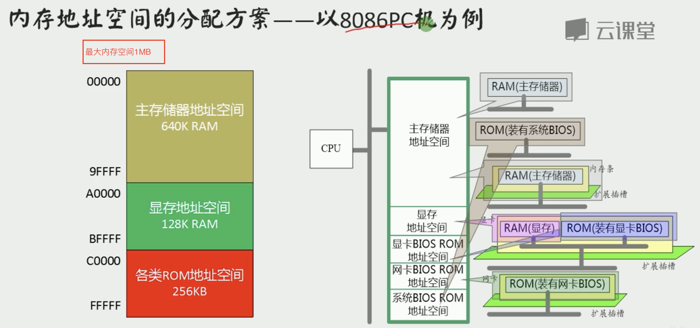
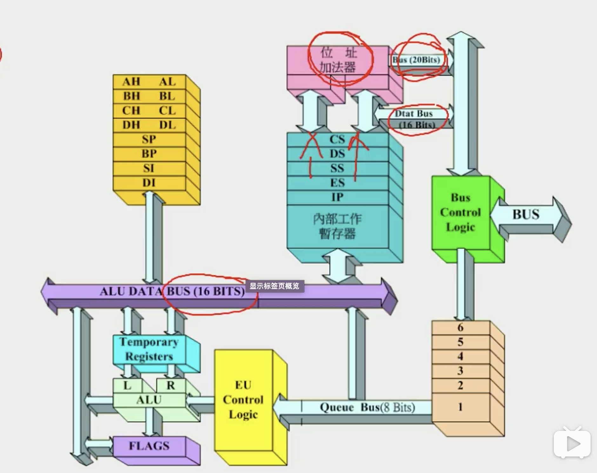
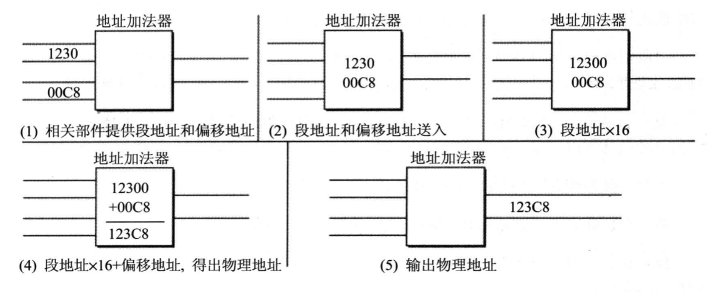
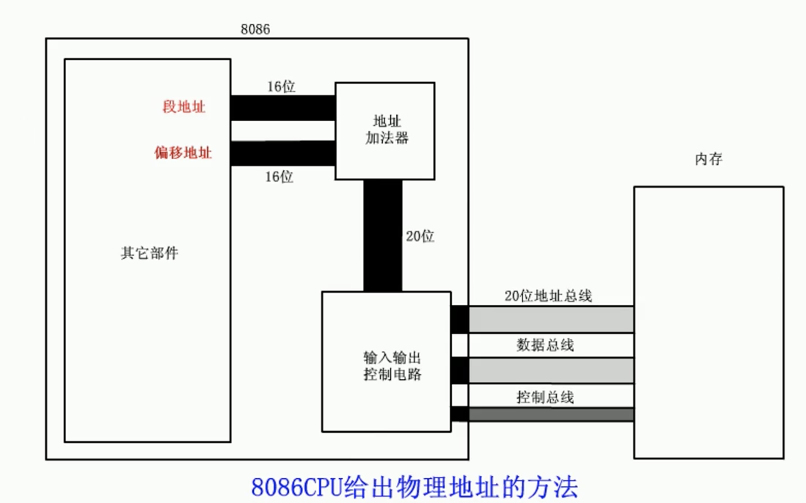

**所有的存储器  (RAM,ROM都算)  都会被看成是一个逻辑存储器, 进行统一编址,每个存储器都会占有一段地址空间**

**向某个特定的内存位置写入信息和数据, 就可以控制某个硬件和传入给这个硬件信息**







## 目录

- [寄存器和数据存储](#寄存器和数据存储)
- [确定物理地址的方法](#确定物理地址的方法)
- [汇编指令详解](#汇编指令详解)
  - [mov和add](#mov和add)
  - 


## 寄存器和数据存储

**8086 CPU 拥有14个寄存器**

**每个寄存器都是16位的, 可以放两个字节**

**8086字长为16位, 目前的32位处理器字长为32位,  X86-64 则是64位字长,字长是运算器每次能处理的数据最大长度**


|      寄存器编号 | 作用                             | 具体描述                 |
| --------------: | -------------------------------- | :----------------------- |
|  **AX**, AH, AL | **通用寄存器, AH高8位, AL低8位** | 存储 运算过程的临时数据  |
|  **BX**, BH, BL | 通用寄存器                       | 存储 运算过程的临时数据  |
| **CX** , CH, CL | 通用寄存器                       | **控制  loop  循环次数** |
|      DX, DH, DL | 通用寄存器                       | 存储 运算过程的临时数据  |
|   ------------- | -------------                    |                          |
|          **SI** | **变址寄存器**                   |                          |
|              DI | 变址寄存器                       |                          |
|   ------------- | -------------                    |                          |
|          **SP** | **指针寄存器**                   |                          |
|              BP | 指针寄存器                       |                          |
|   ------------- | -------------                    |                          |
|          **IP** | **指令指针寄存器**               |                          |
|   ------------- | -------------                    |                          |
|          **CS** | **段寄存器**                     |                          |
|              SS | 段寄存器                         |                          |
|          **DS** | 段寄存器                         |                          |
|              ES | 段寄存器                         |                          |
|   ------------- | -------------                    |                          |
|         **PSW** | **标志寄存器**                   |                          |


## 确定物理地址的方法

**所有内存单元  `( 所有RAM, ROM, 包括显卡和BIOS)` 构成的存储空间是一个   一维的线性空间**

**每一个内存单元在这个空间中都有唯一的地址, 这个唯一的地址称为  物理地址**

**内存并没有分段,  段的划分来自于CPU**

16根地址线 可以寻找的地址为64KB,    `(2^16)/1024= 64KB`

> **8086CPU有20根地址总线, 支持最大1MB内存地址,  0xFFFFF ~ 0x00000**
>
> - 8086使用 两个16位地址 `(段地址,偏移地址)`  合成一个20位的物理地址
>   - **传输给 位址加法器, 来合成一个20位的地址**
>     - **物理地址 =  段地址*16  + 偏移地址**
>       - **`0x12402 = 段地址0x1234 * 16 + 偏移地址0x00C2`**
>       - ==**可以用不同的段地址和偏移地址来表示同一个物理地址**==





# 汇编指令详解

## mov和add

**8位的寄存器 AL, 如果 ADD 加的值过大 产生了向第九位的进位, 那么这个进位会被清除, 不会放到 AH中**

```assembly
mov  AX, 18D     #将 18 十进制立即数放入 AX寄存器,  AX = 18
mov  AX, BX	     #  AX = BX
mov  AL, 0x100   #  AL 还是等于0,溢出位不会添加到 AH中

add  AX, 8       #加法, 将 AX寄存器的值 加上8 ,再写给 AX,  AX+=8
add  AX, BX			 # AX += BX
add  AL, 0x123   # AL = 0x23,  前面的1 会被扔掉,   AX = AH:AL = 0x0023
```


