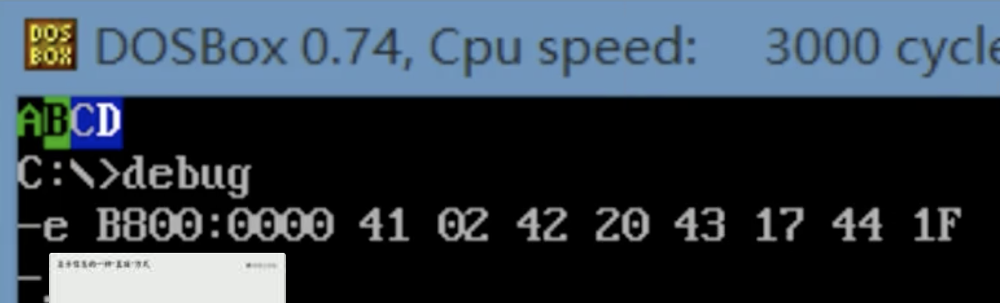

**使用 8086 ASM汇编**

**源程序.asm  通过 编译,链接 生成 二进制机器码文件**

> **ICH HUB 是南桥, IO集中控制器**
>
> **CPU里面存在一块小电池, 用于给 时钟供电**

**所有的存储器  (RAM,ROM都算)  都会被看成是一个逻辑存储器, 进行统一编址,每个存储器都会占有一段地址空间**

**向某个特定的内存位置写入信息和数据, 就可以控制某个硬件和传入给这个硬件信息**


## 目录

- [编译过程](#编译过程)
- [运行过程](#运行过程)
- [文件结构分析与底层工作方法](#文件结构分析与底层工作方法)
- [寄存器和数据存储](#寄存器和数据存储)
- [内存中存储的字型和字节型区分](#内存中存储的字型和字节型区分)
- [时钟](#时钟)
- [确定物理地址的方法](#确定物理地址的方法)
- [代码段操作](#代码段操作)
- [DS和数据段](#DS和数据段)
  - [数据段操作](#数据段操作)
- [栈段指针SS和SP寄存器](#栈段指针SS和SP寄存器)
- [实用程序结构](#实用程序结构)
  - [将字符进行大小写转换示例代码](#将字符进行大小写转换示例代码)
- [伪指令](#伪指令)
  - [伪操作指令](#伪操作指令)
- [汇编操作符](#汇编操作符)
- [汇编指令详解](#汇编指令详解)
  - [mov和add](#mov和add)
  - [sub 减法指令](#sub)
  - [mul 乘法指令](#mul)
  - [div 除法指令](#div)
  - [inc 自增指令](#inc)
  - [dec 自减指令](#dec)
  - [loop 循环指令](#loop)
  - [test测试指令](#test测试指令)
  - [and和or 与和或运算](#and和or)
  - [jmp和jcxz 无条件和有条件跳转指令](#jmp和jcxz)
  - [cmp和ja以及je等条件跳转指令](#cmp和ja以及je等条件跳转指令)
  - [call 和ret  调用和返回指令](#call和ret)
  - [push和pop入栈出栈指令](#push和pop入栈出栈指令)
  - [nop 空指令](#nop)
  - [DF标志位和movsb串传送指令](#DF标志位和movsb串传送指令)
  - [rep 循环后面单个指令](#rep)
  - [移位指令](#移位指令)
  - [in和out端口读写指令](#in和out端口读写指令)
  - [xlat换码指令](#xlat)
  - [LEA和LDS以及LES地址传送指令](#LEA和LDS以及LES地址传送指令)
  - [LAHF和SAHF以及PUSHF和POPF标志寄存器传送指令](#LAHF和SAHF以及PUSHF和POPF标志寄存器传送指令)
  - [CBW和CWD类型转换指令](#CBW和CWD类型转换指令)
  - [十进制调整指令和BCD码](#十进制调整指令和BCD码)
  - [INT中断和IRET中断返回指令](#INT中断和IRET中断返回指令)
  - [处理机控制指令](#处理机控制指令)
- [操作显存数据](#操作显存数据)
- [数据标号](#数据标号)
- [数据的直接定址表](#数据的直接定址表)
- [代码的直接定址表](#代码的直接定址表)
- [对外部设备的控制](#对外部设备的控制)
- [程序结构化标识](#程序结构化标识)
- [多文件函数互相调用方法](#多文件函数互相调用方法)
- 


## 编译过程

**可执行文件 头部有相关描述信息, 其他的没有**

**Dos 使用的 masm 编译器,  源代码中使用的是标志号 十六进制数,  16H ,10D**

**Linux和Mac 使用的是 nasm 编译器, 源代码中使用的是  0x 表示的十六进制数**

**开始执行后, CX 寄存器里面保存的是 代码段的长度**

```bash
# a.asm  -> a.obj  ->  a.out/exe
# 源代码  -> 目标文件 ->  可执行文件
# masm/nasm编译源代码生成目标文件  ->  link 将.obj目标文件 转化成可执行文件

# 其他文件:
	  # masm 会生成以下中间文件
		    # *.LST   列表文件; 编译器将源程序编译成目标文件过程中产生的 中间结果.
		    # *.CRF   交叉引用文件;  和列表文件一样, 是编译器将源程序编译为目标文件过程中产生的中间结果
		# link 会生成以下中间文件
				# *.map    映像文件; 是连接程序将目标文件链接为可执行文件过程中产生的中间结果
				# *.lib    库文件; 包含了一些可以调用的子程序, 就是动态库文件
				

```

- **汇编共分为两次**
  - 第一次汇编 : 确定地址, 翻译成各条机器码, 字符标号原样写出
  - 第二次汇编:  标号代真, 将字符标号用计算出的地址值或偏移量代换
- 伪指令不生成机器码
- 汇编指令域机器指令一一对应


## 运行过程

- **Dos 启动后, 计算机由 '命令解释器' (程序command.com) 控制**
- **运行可执行程序时,  command 将程序加载入内存, 设置 CPU 的CS:IP 指向程序的第一条指令(即程序的入口), 使得程序得以运行**
- **程序运行结束后, 返回到 '命令解释器', CPU 继续执行 command**
- **运行 DosBox的 debug时:**
  - **command程序加载debug.exe**
  - **debug 将 用户程序 加载到内存**
    - 程序运行结束后, 要返回到debug中,  使用q命令来退出debug 
      - **最后会返回到 command中**


## 文件结构分析与底层工作方法


## 寄存器和数据存储

**8086 CPU 拥有14个寄存器**

**每个寄存器都是16位的, 可以放两个字节**

**8086字长为16位, 目前的32位处理器字长为32位,  X86-64 则是64位字长,字长是运算器每次能处理的数据最大长度**

==**保护模式, 实模式 都是以段寄存器为基础的**==


- **`CS:IP  指令地址`**
- **`DS:偏移量  数据地址`**
- **`SS:SP  栈地址`**

|      寄存器编号 | 作用                             | 具体描述                                                     |
| --------------: | -------------------------------- | :----------------------------------------------------------- |
|  **AX**, AH, AL | **通用寄存器, AH高8位, AL低8位** | **整数商寄存器, div BX ;整数商会放在AX , 余数在DX**          |
|  **BX**, BH, BL | 通用寄存器                       | **基址寄存器**                                               |
| **CX** , CH, CL | 通用寄存器                       | **控制  loop循环次数,  程序执行后存放代码长度**              |
|  **DX**, DH, DL | 通用寄存器                       | **余数商寄存器, div BX ;整数商会放在AX , 余数在DX**          |
|   ------------- | -------------                    |                                                              |
|          **SI** | **源变址寄存器**                 | **常用用于地址偏移量表示,  DS:SI**                           |
|          **DI** | **目标变址寄存器**               | **常用用于地址偏移量表示, ES:DI**                            |
|   ------------- | -------------                    |                                                              |
|          **SP** | **指针寄存器**                   | **栈顶偏移地址,  SS:SP**                                     |
|              BP | 堆栈基址指针寄存器               | **在栈内寻址使用,获取栈内任意位置数据,  SS:BP**              |
|   ------------- | -------------                    |                                                              |
|          **IP** | **指令指针寄存器**               | **指向下一条要执行的指令的地址, CS:IP 才是地址位置**         |
|   ------------- | -------------                    |                                                              |
|          **CS** | **代码段寄存器**                 | **代码段寄存器, CS:IP 表示下条指令地址, 会被抽象为PC寄存器** |
|          **SS** | 栈段寄存器   **stack栈**         | **栈段地址寄存器,  SS:SP  表示栈顶位置**                     |
|          **DS** | 数据段寄存器                     | **数据段寄存器,  DS:偏移量   即可得到数据段的地址**          |
|          **ES** | 附加段寄存器                     | **都是内存操作, 与串操作代码有关, ES:DI**                    |
|              FS | 附加段寄存器                     |                                                              |
|              GS | 附加段寄存器                     |                                                              |
|   ------------- | -------------段基址寄存器        | **4个内存管理寄存器**                                        |
|            GDTR | **全局描述符表寄存器**           | 指向GDT表 ,加载GDTR寄存器指令 LGDT ,保存 SGDT                |
|            IDTR | 中断描述符表寄存器               | 指向IDT表 ,加载 IDTR寄存器指令 LIDT ,保存 SIDT               |
|            LDTR | 局部描述符表寄存器               | 指向LDT表 ,加载 LDTR寄存器指令 LLDT ,保存 SLDT               |
|              TR | 任务状态寄存器                   | 存放当前任务TSS段的选择符,基地址,段长度和描述符属性,  LTR 和STR 指令 |
|   ------------- | -------------                    |                                                              |
|  **PSW / FALG** | **标志寄存器**                   | **程序状态字寄存器, DF标志位**                               |
|   ------------- | -------------                    |                                                              |
|         **ESP** | **栈帧寄存器**                   |                                                              |
|   ------------- | -------------控制寄存器          | 控制和确定处理器的操作模式以及当前执行任务的特性             |
|             CR0 | 控制寄存器0                      | 控制处理器操作模式和状态的系统控制标志                       |
|             CR1 | 控制寄存器1                      | 保留                                                         |
|             CR2 | 控制寄存器2                      | 含有导致页错误的线性地址                                     |
|             CR3 | 控制寄存器3                      | 含有页目录表物理内存基地址,  也称页目录基地址寄存器 PDBR     |


## **PSW/FLAG 标志位寄存器的示意图**

| 31~19 | 18   | 17   | 16   | 15   | 14   | 13   | 12   | 11   | 10     | 9    | 8    | 7    | 6    | 5    | 4    | 3    | 2    | 1    | 0    |
| ----- | ---- | ---- | ---- | ---- | ---- | ---- | ---- | ---- | ------ | ---- | ---- | ---- | ---- | ---- | ---- | ---- | ---- | ---- | ---- |
| 0     | 0    | VM   | RF   | 0    | NT   | IOPL | IOPL | OF   | **DF** | IF   | TF   | SF   | ZF   | 0    | AF   | 0    | PF   | 1    | CF   |

- **CF : 记录相关运算指令执行后,  无符号数运算   最高有效位向更高的假想位 进位或借位 时 该值为1.当AL=98H , `add AL,AL`,执行后CF=1,   进位标志**
- **PF :记录相关运算指令执行后, 其结果中 1 的个数是否为偶数, 1的个数为偶数或0 时 PF=1, 当1的个数为奇数时 PF=0,  恢复标志**
- **AF : 辅助进位**
- **ZF  :记录相关运算指令执行后, 其结果为0时 那么 ZF标志位=1 , 否则 ZF=0**
- **SF : 记录相关运算指令执行后, 其结果是否为负数, 如果结果为负数那么 SF=1, 非负数 SF=0**
- **TF : 跟踪标志, 单步执行指令,处理器会在每条指令执行后产生一个调用异常, 可使用 `POPF, POPFD 或 IRET` 设置该标志**
- **IF : 中断允许标志 中断允许标志位，由`CLI`，`STI`两条指令来控制；设置IF位使CPU可识别外部(可屏蔽)中断请求，复位IF位则禁止中断；IF位对不可屏蔽外部中断和故障中断的识别没有任何作用**
- **DF  :控制 `movsb 和 movsw` 指令中操作的 SI和DI寄存器的增减, 由`CLD`，`STD`两条指令控制；复位DF标志位，字符串操作指令中`SI`，`DI`值自增；设置DF位字符串操作指令中`SI`，`DI`值自减**
- **OF :记录相关运算指令执行后,  有符号数运算 是否发生溢出, 溢出OF=1, 没有溢出 OF=0,  溢出**
- **IOPL(I/O Privilege Level)**：I/O特权级字段，宽度2位, 只用于控制IO访问, 可屏蔽硬件中断,调试,任务切换,以及虚拟8086模式, 只有当 CPL小于等于这个IOLP才能访问I/O地址空间, 而且CPL为特权级0时, 程序才可以使用 `POPF 或 IRET` 指令修改这个字段.   该标志还控制对 IF标志的修改机制之一
- **NT: 控制中断返回指令`IRET`, 控制着被中断任务和调用任务之间的链接关系.递归调用**
- **RF: 恢复标志, 控制处理器对断点指令的响应  `IRETD` 来设置, 为1时会禁止断点调试**
- **VM: 虚拟8086模式, 设置时, 开启虚拟8086模式, 当为0时 ,着回到保护模式**
- 19~31:  保留, 设置为0


##### 段寄存器使用约定

| 访问存储区类型     | 缺省段寄存器 | 可指定段寄存器 | 段内偏移地址来源       |
| ------------------ | ------------ | -------------- | ---------------------- |
| 取指令码           | CS           | 无             | IP                     |
| 堆栈操作           | SS           | 无             | SP                     |
| BP用作基地址寄存器 | SS           | CS DS ES       | 依寻址方式寻找有效地址 |
| 串操作源地址       | DS           | CS DS ES       | SI                     |
| 串操作目的地址     | ES           | 无             | DI                     |
| 一般数据存取       | DS           | CS DS ES       | 依寻址方式寻找有效地址 |

##### 


## 内存中存储的字型和字节型区分

- **字 （word）计算机进行数据处理时，一次存取、加工和传送的数据长度称为字**
- **8086CPU 一个字是2字节, x86是4字节(双字) , x86_64 是8字节(四字)**
  - 0 地址 **单元** 中存放的 **字节型** 数据是 0x20,  一个字节
  - 0地 **字单元** 中存放的是 **字型** 数据是 0x4E20 , 两个字节, 小端


## 时钟

- **CPU 里面存在两个时钟**
  - 计时器,  由 CPU 内部的一小块电池供电
  - 间隔时钟,  每过一段时间就发出一个中断, 用于控制CPU进程的调度


## 确定物理地址的方法

**所有内存单元  `( 所有RAM, ROM, 包括显卡和BIOS)` 构成的存储空间是一个   一维的线性空间**

**每一个内存单元在这个空间中都有唯一的地址, 这个唯一的地址称为  物理地址**

**内存并没有分段,  段的划分来自于CPU**

16根地址线 可以寻找的地址为64KB,    `(2^16)/1024= 64KB`

==**`CS代码段寄存器, DS数据段寄存器 , SS栈段寄存器,  ES附加段寄存器`**==

> **8086CPU有20根地址总线, 支持最大1MB内存地址,  0xFFFFF ~ 0x00000**
>
> - 8086使用 两个16位地址 `(段地址,偏移地址)`  合成一个20位的物理地址
>   - **传输给 位址加法器, 来合成一个20位的地址**
>     - **物理地址 =  段地址*16  + 偏移地址**
>       - **`0x12402 = 段地址0x1234 * 16 + 偏移地址0x00C2`**
>       - ==**可以用不同的段地址和偏移地址来表示同一个物理地址**==
> - **假设: 数据在 0x21F69 内存单元中, 段地址是 0x2000 **
>   - **数据存在内存  2000:1F60 单元中. 都是十六进制表示. CS=0x2000, IP=0x1F60**
>   - **数据存在内存的 0x2000段中的  0x1F60 单元中**


## 代码段操作

**CS:IP 是 CPU将要执行的下一条指令的地址**

**使用 jmp指令 来修改 CS和IP,   mov无法修改IP**

```assembly
jmp  段地址:偏移地址
jmp  2AE3:2      #跳转到 0x2AE32 地址处执行,  同时CS修改为 0x2AE3, IP为0x02
jmp  AX          #将IP修改为 AX,并跳转, 当前段:AX
```


## DS和数据段

**将一组长度为N `(N <= 64KB)`, 地址连续, 起始地址为16的倍数的内存单元作为专门存储数据的内存空间, 从而定义了数据段**

**物理地址 = 段地址DS *16 + 偏移地址**

- **段地址就是  DS寄存器的值,  DS段寄存器可以使用其他的寄存器或内存中存储的值来初始化,不能直接给立即数**
- **偏移地址 随便给, 立即数 和寄存器 以及从内存取值都行 , 只要不大于 0xFFFF 即可**

```assembly
mov  DS, [1]    ; 从内存取值, 写给 DS 数据段寄存器
mov  DS, ax
mov  [1], DS

mov  AX, [BX + 200 + SI]   ; 与上面相同, 只不过多了个 0x200 十六进制立即数
mov  AX, [200 + BX + SI]	 ; 与上面相同
mov  AX, 200[BX][SI]       ; 与上面相同
mov  AX, [BX].200[SI]      ; 与上面相同, 都是加法
mov  AX, [BX][SI].200      ; 与上面相同, 都是加法


mov [DI] ,   AX    ; AX的 值写入  DS:DI 内存位置
mov [DI]20,  AX    ; AX的值 写入  DS:DI+20 内存位置,  下面的都是这种方式的变种
mov [20+DI], AX
mov 20[DI],  AX
mov [DI].20,  AX
mov 20.[DI],  AX
mov [20][DI], AX


```


## 数据段操作

**用 DS寄存器加偏移值就可以访问那个位置的数据**

**先修改数据段, 成为自己想要访问的地址的数据段,然后再给出偏移即可**

**8086CPU不支持使用 立即数修改段寄存器,必须通过通用寄存器来进行修改 (IP指针寄存器除外,需用jmp)**

```assembly
;先使用BX来设置 DS数据段寄存器的值
push BX  ;先保存
push DS

mov  BX, 0x1000
mov  DS, BX    ; 设置数据段, 如果不设置, 就会读取当前数据段的值
mov  AL, [0]   ; 读取1个字节的数据, 后面翻译成 [DS:0], 物理地址是 0x10000
mov  AX, [1]   ; 读取2个字节的数据, [DS:1]

mov  AX, [BX + 1]   ; 读取 BX寄存器的值 然后+1, 在与 DS组合 ,得到数据地址,然后取出地址数据给AX
mov  AX, 200[bx]    ; 与 mov AX, [BX +200] 相同
mov  AX, [BX].200   ; 与 mov AX, [BX +200] 相同

mov  AX, [BX + SI]   ; 将 BX 当作基址寄存器, 将 SI当初变址寄存器 ,以及DS段寄存器  组合来进行寻址
mov  AX, [BX] [SI]   ; 与 mov AX, [BX + SI] 相同

mov  AX, [BX + 200 + SI]   ; 与上面相同, 只不过多了个 0x200 十六进制立即数
mov  AX, [200 + BX + SI]	 ; 与上面相同
mov  AX, 200[BX][SI]       ; 与上面相同
mov  AX, [BX].200[SI]      ; 与上面相同, 都是加法
mov  AX, [BX][SI].200      ; 与上面相同, 都是加法


mov  [BX+1] , AX  ; 将AX的值 给予,  DS:BX+1 , BX寄存器的值+1 ,偏移地址
mov  [4], AX     # 将AX寄存器中两个字节的内容, 放到 DS:4 数据段指向的位置, 占据 0x10004和0x10005
mov  [2], AL     # 将AX寄存器中两个字节的内容, 放到 DS:4 数据段指向的位置, 占据 0x10002


pop  DS
pop  BX
```


## 栈段指针SS和SP寄存器

**CPU不会检查和限制 SP 的栈越界**

```assembly
; SS:SP 是栈顶地址, 从高地址向低地址递减,  SS栈顶段地址:SP栈顶偏移地址
  ; SS:SP 指向栈顶,有数据时他的指向是最后压入进来的数据低地址位置, 栈为空时, 指向无数据位置
; SS 栈顶段寄存器可以通过 寄存器 和 内存数据 来进行赋值
; SP 偏移值 可以使用很多方法赋值
; 栈以 SP为准, 确定能存储数据的长度,  当 SP=0xFF 时, 那么栈只能存储 256个字节
  ; 当 SP为0 后, 继续使用 push  AL 指令, 那么SP会变成 FF , SS不变, 但栈异常了, 不可以这么做

	
push  AX  ;首先 SP指针减2(AX寄存器2字节), 然后将AX寄存器的值入栈,从低地址向高地址方向写
            ; 计算方式: (SP) = (SP) -2
                   ;   ((SS)*16 + (SP)) = (AX)  ;前面表示的是地址, 后面是将AX内容写入这个地址
                   
pop   AX  ; 先将栈顶的值弹出,赋给AX寄存器,  然后再计算 SP= SP +2 
            ; 计算方式:  (AX) = ((SS)*16 + (SP))
            ;           (SP) = (SP) + 2    ;将SP寄存器的值取出来 +2, 再放到SP里面去
```


## 实用程序结构

```assembly
assume cs:code , ds:data, ss:stack
data segment   ;设置数据段的内容和位置, 应该让DS段寄存器等于这个值
	dw 0123H, 0456H, 0abcH, 0defH, 0fedH, 0cbaH, 0987H ;8个双字, 占据 16字节
data ends

stack segment ;设置栈段的内容和位置, 当SS段寄存器 等于这个值
	dw 0,0,0,0,0,0,0,0,0,0,0,0,0,0,0,0   ; 16个 双字,占据 32字节
stack ends

; 代码段是默认初始化的, 不需要设置 ,运行时系统就会自动指定
code segment  ; 设置代码段内容和位置
start:
 ; 初始化 各个段寄存器
	mov  AX, stack    ; 栈段的位置值 给予AX
	mov  SS, AX       ; 将AX的值 赋予 SS段寄存器
	mov  SP, 20H      ; 栈的长度, SP =20,  只存放 32字节的数据,SS:SP 
	mov  AX, data     ; 数据段的位置值 给予AX
	mov  DS, AX       ; 初始化数据段, DS:偏移量.    0 <= 偏移量 < 10H
	
;入栈操作
	mov  BX,0
	mov  CX,8    ;设置循环为8次 , 实际执行为 9次, 第一次执行不算做循环
s: 
  push [BX]    ;将 DS:BX 数据段 内存位置的值入栈, 入栈宽度为2,  SP -= 2
  add  BX, 2   ; BX += 2
  pool s 
  
;出栈操作
	mov  BX, 0
	mov  CX, 8
p:
  pop   [BX]  ; 这种出栈顺序, 会将上面入栈的内容,倒过来读取,  12 34 56 变  56 34 12
  add   BX, 2
  loop  p
	
	; 程序结束 , 交还CPU控制权
	mov  AX, 4c00H  ; 运行完最后这两条指令,当前进程就会结束, 最后这两条指令结合起到一个作用
	int  21H        ; 作用是: 程序运行结束后, 将CPU的控制权交给使它得以运行的程序 (通常是DOS系统)

code ends     ;与上面的 code segment 配合, 表示段结束
end   start     ;汇编程序结束标记,让编译器知道 程序在此处结束
	
```


## 将字符进行大小写转换示例代码

```assembly
assume   cs:codesg, ds:datasg 


datasg segment
	db 'BaSiC'         ;小写转大写 ,大写比小写 小20H
	db 'iNfOrMaTiOn'   ;大写转小写
datasg ends


codesg segment
start:
	mov AX, datasg
	mov DS, AX

	mov CX , 5
	mov BX, 0

big:
	mov  AL, [BX]   ; DS:BL
	and  AL,  11011111b    ;0xDF
	mov  [BX], AL
	inc   BX  ;1  2  3   4 
	loop  big ;4 3  2 1  0

	mov CX, 000BH;  0xA
sum:
	mov AL, [BX]
	or  AL,  100000b ;  0x20
	mov [BX] , AL
	inc  BX
	loop sum


	mov ax,4c00H
	int 21H
	
codesg ends
end start
```


# 伪指令

**伪指令没有对应的 机器码 指令, 最终不会被CPU执行**

**伪指令 是由编译器来执行的指令, 编译器根据伪指令来进行相关的编译工作**

> **end   start     ;汇编程序结束标记,让编译器知道 程序在此处结束, 同时 start 也是程序开始执行位置的标号**

- **assume**
  - **segment**
    - **db**
    - **dw**
    - **dd**
      - **dup**
  - **ends**
- **end**

```assembly
assume cs:codesg   ;伪指令, 段定义, 假设某个 段寄存器 和程序中的某个用 segment ... ends定义的段
									 ; 相关联,  assume cs:codesg 指的是 CS寄存器与 codesg关联, 将定义的 codesg
									 ; 当作程序代码段使用, 也就是计算当前代码段位置,然后赋值给 CS:IP
assume ds:datasg  ;段名,  segment关键字表示 段从当前开始,设置的是数据段,需要将这个值给予DS段寄存器
datasg segment
	db 'BaSiC'         ;这样来定义数据, 每个字符占1字节, 默认位置是  datasg:0, 从B开始
	
	db  3 dup(0)       ;dup伪指令, 定义三个字节, 它们的值都是0, 相当于 db 0,0,0
	dw  4 dup(0,1,2,3) ;定义32个字节, 由 0,1,2,3,0,1,2,3,0,1,2,3  构成
										  ;相当于 dw 0,1,2,3,0,1,2,3,0,1,2,3  ; 每个数据都占用2字节
	db 2 dup ('abc', 'ABC')  ; 定义12字节, 相当于  db 'abcABCabcABC'
	dd 2 dup (1,2,3)  ; 定义24字节,相当于两组  db 0x0000 0001 ,0x0000 0002 ,0x0000 0003
datasg ends          ;定义结束符
									 
codesg segment    
; 上面两条代码在 nasm 汇编中并不存在, 最下面的两条也不存在,  只能在 Dos中使用
start:
	mov  AX, datasg  ; 段位置
	mov  DS, AX      ;段位置给予DS寄存器, 默认偏移值为0,   DS:0
	mov  ax, 0123H  ; 上下两部分都是伪指令
	mov  ax, codesg   ;可以这么使用

ret:
	; 进程在再退出前, 应该使用下面的两条代码 执行退出指令, 交还CPU控制权
	mov  AX, 4c00H  ; 运行完最后这两条指令,当前进程就会结束, 最后这两条指令结合起到一个作用
	int  21H        ; 作用是: 程序运行结束后, 将CPU的控制权交给使它得以运行的程序 (通常是DOS系统)

codesg ends     ;与上面的 codesg segment 配合, 表示段结束
end   start     ;汇编程序结束标记,让编译器知道 程序在此处结束, 同时 start 也是程序开始执行位置的标号
```


## 伪操作指令

> **伪操作: 在汇编程序对源程序汇编期间, 由 汇编程序(编译器) 处理的操作, 可以完成 如 数据定义, 分配存储区, 指示程序结束等功能**

- **处理器选择伪操作**

  - 选择 汇编代码在哪种CPU上面去执行
    - .8086  , .286 (80286), .286P(保护模式下的80286), .386(80386),  .386P,  .486, .486P, .586(Pentium指令系统),  .586P

- **段定义伪操作**

  - **定义段地址**

    - `assume CS:code, ds:data, es:extra ;; data segment ;; data ends ;;`

    - ```assembly
      ; .MODEL 存储模式, 其他选项
        ; 存储模式 (定义存储模式, 指定在内存中如何安放各段): 
           ;   tiny  通常与内存映像文件(com) 对应, 代码段和数据段都不会不超过64K
           ;   small 代码段和数据段 都不会超过64K(不包括加起来), call 均为near模式,段偏移即可定位
           ;   huge  代码段和数据段不受64K限制, 跳转,call指令允许使用 far模式
           ;   large  代码段和数据段都可以定义多个, 支持远访问
           ;   还有这几种存储模式  medium, compact, flat
      ; .MODEL 需要写在源码的开头位置
      ;范例
      .MODEL small
        
      assume 段寄存器:段名, 段寄存器2:段名2
      
      
      
      段名 segment 定位类型  组合类型  适用类型  类别
         ; 定位类型 align_type 对齐类型, 这个段在分配空间时的一个策略
             ; 参数: BYTE字节对齐, WORD字对齐, DWORD双字对齐, PAGE页对齐(4K)
             
         ; 组合类型, 多文件链接时, 其他文件是否可以访问该数据段内容和空间
             ; 参数: PRIVATE私有, PUBLIC公有, COMMON, STACK栈空间, AT, exp
             
         ; 使用类型, use_type  ,使用内存的一种指示
         	   ; 参数: USE16十六位,  USE32三十二位
         	    数据标号 SEGMENT USE16
         	    
         ; 类别 class
            ... ;语句序列
      段名 ends
      
      
      
      ;简化段定义伪操作
        ; .code name  ; 定义代码段,名称为 name, 会自动赋予地址给 CS:IP 寄存器
        ; .data       ;定义数据段 , 自动赋予段地址给 DS 寄存器
        ; .data?
        ; .fardata name  ;定义远数据段
        ; .fardata? name  
        ; .const
        ; .stack size ;定义栈空间大小, size是字节单位长度, 自动赋予地址给 SS:SP 寄存器
      ```

- **程序开始和结束伪操作**

  - 

    ```assembly
    ;下面两种形式任选其一, 但为了兼容型, 还是使用 `end 标号` 比较好
    end 标号  ;标号的下面是代码段, 这个end写在代码块之外, 上面有源程序例程
    
    
    ;下面两个组合分别代表代码段的开始和结束
    .startup     ;代替 mov ax,data  和 mov ds,ax , 代表程序开始位置, masm5.1 以上支持(不包括5.1)
    .exit 返回值  ;代替 mov ax,4c00h 和 int 21h , 写在代码段中, 代表程序结束,返回给父线程控制权
    end
    ```

  - 

- **数据定义及存储器分配伪操作**

  - ```assembly
    数据标号 助记符 操作数,操作数2...
     ; 数据标号就是变量名,该行数据的偏移值, 与DS组合使用, DS:数据标号
     ; 助记符就是 DB, DW, DD, DF, DQ, DT  每个操作数,数据的空间大小
       ; 操作数可以是 字符,字母,数字, 还有 ?问号, 这个问号代表 随机值 (任何值)
    
    例子:
    DATA_BYTE    DB  10,4,10h,?   ;每个数字占1字节, 共占4字节 ,DATA_BYTE是数据标号, 10是十进制
    DATA_BYTE2   DW  DATA_BYTE,1,2  ;DATA_BYTE是偏移地址, DS:DATA_BYTE, 来读取数据
    
    
    DATA_dup1  DD 16 dup(0)    ;1*16*4 的数据段长度被赋予0
    DATA_dup2  DD 16 dup(?)    ;1*16*4 的数据段长度被赋予 随机值
    DATA_dup3  DD 2 dup(12,34,56)    ; 3*2*4的数据段长度被赋予 12,34,56, 12,34,56, 
    DATA_dup4  DB 2 dup(0, 1, 2 dup(4,5), 6)  ;4,5会出现2次, 0,1,4,5,4,5,6,  0,1,4,5,4,5,6
    DATA_dup5  Dw 2 dup(0, 1, DATA_dup4, 6)   ;必须大于或等于DW宽度,  0,1,偏移值,6, 0,1,偏移值,6
    
    
    
    变量名 LABEL 类型
    ; 同一变量(同一空间) 将具有不同的类型,只作用于他下面那个变量空间, 与引用类似
    BYTE_ARRAY LABEL BYTE        ;可以按照字节去获取 WORD_ARRAY的数据, 相当于强制类型转换, 100字节
    WORD_ARRAY DW 50 DUP(?)      ; 只能按照 字 来获取 WORD_ARRAY的数据, 原数据, 50字
    ```

- **表达式赋值伪操作**

  - ```assembly
    表达式名  EQU  表达式
      ; 类似与全局常量, 表达式名是常量名, EQU是关键字, 表达式可以是数字或内存偏移地址或其他常量名
      ;   不可以重复定义
      ALPHA EQU 9      ;ALPHA 在代码中就代表9
      BETA  EQU ALPHA+5  ;BETA 在代码中就代表 ALPHA+5= Eh 这个值
    
    
    = 伪操作
      EMP = 1     ;简化式全局变量, EMP这个变量名就代表 1
      EMP = EMP +1  ; 这时候 EMP就等于2了,  可以重复定义
    ```

  - 

- **地址计数器与对准伪操作**

  - ```assembly
    ORG 偏移量    ;用在伪代码数据段设置中, 让下面的数据偏移一些位置,然后再给予赋值, 绝对位置,从0开始计算
    ORG $+偏移量   ;相对位置计算, 从上个数据标号结束处开始计算偏移量
    
    ALIGN 幂    ;也是偏移值,默认相对偏移, 保证下个数据数据 的地址是可以整除 幂 这个参数的 (就是对齐)
    
    	DATA segment
    		ORG 8    
    		VAR1 DB 12h    ;VAR1数据标号就是 8, 前面空出来8个位置
    		ORG 8
    		VAR2 DB 34h     ;会覆盖上面的 VAR1, 变成34, 绝对位置计算. VAR2数据标号还是8
    		ORG $+2
    		VAR3 DB 56     ;会距离 VAR2 数据标号位置+2 再加上数据长度 个位置进行写入,VAR3标号是Ah
    	DATA ends
    ```

  - 

- **基数控制伪操作**

  - 

    ```assembly
    .RADIX  表达式   ;控制当前代码中出现的数字是 十进制还是 十六进制
    	.RADIX 16      ;16进制, 想表达十进制数 ,就在末尾添加 D 标志
    	.RADIX 10      ;10进制,  这个默认的模式
    ```

  - 


# 汇编操作符

> **操作符作用: 用于操作数中,通过操作符 将常数,寄存器,标号,变量等, 组合成表达式, 实现求值的目的,这个过程是在汇编编译时进行的**

- **算数操作符**

  - **只适用于 立即数, 数据标号 之类的内容, 但是寄存器是无法直接使用的 (寄存器间接寻址并不计算在内)**

  - ```matlab
    +     -    *      /      MOD   
    加    减    乘    除       取余
    ```

- **逻辑和移位操作符**

  - ```assembly
    AND,  OR,  XOR,  NOT,  SHL,  SHR
    
    MOV AX, 0FFH AND 12  ;是逻辑操作符 , 并 操作
    MOV AX, 1 SHL 2      ;数字1 逻辑左移两位, 赋值给AX
    ```

- **关系操作符**

  - ```assembly
    EQ     NE      LT    LE        GT     GE
    等于   不等于   小于   小于等于    大于   大于等于
    
    计算结果为逻辑值:   真 0FFFFH
                     假  0000H
    
    MOV  AX, (2 - 2) EQ 0    ;表达式的结果为 真,0=0 , AX的值就是 0FFFFH
    ```

  - 

- **数值回送操作符**

  - ```assembly
    OFFSET     ;取得标号的偏移地址          
    SEG        ;取得标号的段地址
    TYPE 标号   ;获取数据标号后面代表 数据的每个元素的字节宽度
    					    ; DB=1, DD=4, DF=6, DQ=8, DT=Ah, NEAR=-1, FAR=-2, 常数0~9=0
    LENGTH 标号 ; 返回由 DUP 定义的 元素个数, 其他情况返回1, 相当于数据的元素个数 
    SIZE   标号或变量   ;整合计算, 相当于得到 YTPE * LENGTH 
    
    
    data segment  ;数据段定义
    	ARRAY DW 100 DUP(?)   ;数据标号, 每个元素占一个字
    	TABLE DB 'ABCD'       ; 数据标号, 每个元素一个字节
    data ends
    
    MOV AX, TYPE ARRAY ;  相当于 MOV AX, 2
    ADD AX, TYPE TABLE ;  相当于 MOV AX, 1
    
    MOV AX, LENGTH ARRAY   ;相当于 MOV AX, 064H    ;64h=100d
    MOV AX, LENGTH TABLE   ;相当于 MOV AX, 1
    
    MOV AX, SIZE ARRAY   ; 相当于 MOV AX, 100d * 2 = 200d  
    MOV AX, SIZE TABLE   ; 相当于 MOV AX, 1 * 1 =1 ,因为TYPE =1,  LENGTH=1 相乘就等于1
    ```
    
  - 

- **属性操作符**

  - ```assembly
    类型 PTR 表达式  ;通过类型来修饰后面的表达式
    段操作符         ;访问内存默认是DS寄存器当作段寄存器, 这里可以修改成其他的, 比如ES段寄存器
    SHORT           ;短转移类型属性
    THIS            ;修饰 EQU 常量名属性来使用, 可以修饰代码段和数据段
    HIGH            ;与数据段关联,  在代码中取高地址内容
    LOW             ;与数据段关联,  在代码中取低地址内容
    HIGHWORD
    LOWWORD
    
    
    MOV WORD PTR [BX],5  ;PTR , 将数值5移动到 DS:BX 内存位置中, 并且这个位置的数据是一个字 
    MOV ES:[BX] ,AL      ;将 AL的值写入 ES:BX 内存位置中
    JMP SHORT next      ;短转移, 只记录偏移值, next是标号
    
    TA EQU THIS BYTE    ;TA 是一个常量标志,通过THIS属性 可以将下面的 TD数据标号的空间看成字节来使用
    TD  DW 1234h	      ;正常的一个数据标号
    
    TAJ EQU THIS FAR   ;与下面的代码关联, 可以使用 jmp TAJ 来跳转到下面的代码处执行, 远眺转
    MOV AX,2           ;正常的一个代码段
    
    CONS EQU 1234h    ;正常的一个常量数据
    MOV AH, HIGH CONS  ;AH 会被赋予 12h
    MOV AL, LOW  CONS  ;AL 会被赋予 34h
    
    ```

  - 

# 汇编指令详解

`[ ]` 表示取地址的值, `idata` 表示一个常量(1,2,3..) 这个并不是汇编语法内容.

## mov和add

**8位的寄存器 AL, 如果 ADD 加的值过大 产生了向第九位的进位, 那么这个进位会被清除, 不会放到 AH中**

```assembly
mov  AX, 18H     #将 18 十六进制立即数放入 AX寄存器,  AX = 18
mov  AX, BX	     #  AX = BX
mov  AL, 0x100   #  AL是8位寄存器,加上一个9位数还是等于0,溢出位不会添加到 AH中
mov  AL, [2]     # 读取数据段DS寄存器 加2 偏移值 指向的数据内容,放到AL, 读取一个字节
mov  [4], AX     # 将AX寄存器中的内容, 放到DS寄存器加2偏移值的 数据段指向的位置
mov  [BX+SI], AL  #将AL寄存器的值写入地址  DS:BX+SI, 必须是 BX+SI, 否则该指令错误


add  AX, 8       #加法, 将 AX寄存器的值 加上8 ,再写给 AX,  AX+=8
add  AX, BX			 # AX += BX
add  AL, 0x123   # AL = 0x23,  前面的1 会被扔掉,   AX = AH:AL = 0x0023
add  [0],  AL    # 取 DS:0 内存位置的数据, 与AL寄存器的内容相加, 结果写入 DS:0 内存位置


```


## sub

**减法指令**

```assembly
sub  BX,1       # BX = BX -1    寄存器的值减去1, 再写入 BX寄存器
sub  AX,[1]     # AX = AX - [DS:1]
sub  [2], AX    # [DS:2] = [DS:2] - AX
```


## mul

**乘法指令**

- **两个相乘的数 要么都是8位, 要么就都是16位**
  - **如果是8位的两个数相乘,  一个乘数默认放在 `AL寄存器中` ,一个放在 8位的 `某个寄存器 或内存 字节 单元中`**
  - **如果是16位的两个数相乘,  一个乘数默认放在 `AX寄存器中` ,一个放在 16位的 `某个寄存器 或内存 字 单元中`**
- **乘法结果:**
  - **8位乘法,  结果默认放在 `AX寄存器` 当中** 
  - **16位乘法, 结果的 高16位默认在 `DX寄存器` 中存放, 低16位在 `AX寄存器` 中存放**
- **计算的结果如果大于 255  就必须用16位乘法**

```assembly
mov  al, 1f0H   ;将一个乘数放在 默认的AL寄存器中
mov  bl, 1e     ; 另一个乘数, 当作参数传给 乘法指令
mul  bl        ; 做 8位 乘法, 结果放在 AX寄存器当中


mov  AX, 12fH   ;将一个乘数放在 默认的AX寄存器中
mov  BX, 12eH   ; BX 保存了内存地址的偏移量
mul  [BX]       ; 取AX寄存器的值, 与内存 DS:BX 位置的值  做 16位 乘法
							    ; 结果的 高16位在 DX寄存器当中, 低16位在 AX寄存器中存放
```


## div

**除法指令**

- **两个数相除,  除数为8位,那么被除数应该位16位,  除数为16位, 被除数就应该是32位**
  - **被除数为 16位, 则除数应设置为8位`(内存或寄存器)`,  被除数默认放在 `AX寄存器` 中**
  - **被除数为 32位, 则除数应设置为16位,  被除数 低16位放在 `AX寄存器中 ,高16位放在 DX寄存器中` **
- **除法结果:**
  - **除数为8位,  结果默认 的商放在 `AL寄存器` 当中, 余数则放在 `AH寄存器` 当中** 
  - **除数为16位,  结果默认 的商放在 `AX寄存器` 当中, 余数则放在 `DX寄存器` 当中** 

```assembly
mov  AX, 1f0H   ;将 被除数  放在默认的AX寄存器中   6/2
mov  bl, 1e     ; 除数, 当作参数传给 乘法指令
div  bl        ; 做 8位 除法, 结果放在 AX寄存器当中


mov  DX, 012fH   ;将一个被除数的高16位放在 默认的DX寄存器中
mov  AX, 012fH   ;将一个被除数的低16位放在 默认的AX寄存器中
mov  BX, 12eH   ; 被除数从内存中读取, 进行16位除法
mul  [BX]       ; 取AX寄存器与DX 寄存器的值, 与内存 DS:BX 位置的值  做 16位 除法
							    ; 结果的 高16位在 DX寄存器当中, 低16位在 AX寄存器中存放
```


## inc

**自增指令**

```assembly
inc  BX   ; 将 BX寄存器的值 增加1 并写回 BX
          ; 同样无法用于 SS  CS  SP 等 栈寄存器
```


## dec

**自减指令**

```assembly
dec  BX   ; 将 BX寄存器的值 减少1 并写回 BX
          ; 同样无法用于 SS  CS  SP 等 栈寄存器
```


## loop

**计数型循环指令**

**首先会减少 CX寄存器的值, 然后再查看减1后的CX寄存器是否大于0**

```assembly
start:           ; start:  表示的是标号, 好比 goto start;  代码
	mov   CX, 10H  ; 10H = 0x10
	loop  start    ; 好比goto 到 start, 先将 CX寄存器的值 -1, 然后再判断CX是否为 0 然后停止循环
				         ; start 标号就是 IP寄存器所存储的偏移值
				         ; loop [SP:IP]   ;与跳转相当,会将CX寄存器的值-1,大于0时,会修改SP和IP寄存器的值
```


## test测试指令

```assembly
text 寄存器1, 寄存器2
;	测试与运算, 结果不会写入到寄存器  , 只会更改标志位寄存器的值 
;   第一个寄存器 减去 第二个寄存器的值
;  判断结果的第一位是否为1 ,如果是  则 ZF=1
```


## and和or

**and与,  or或**

```assembly
and   AX, 010101b  ;这里尽量使用二进制,  AX = AX & 0x15
or    BX, 010101b  ; BX =  BX | 0x15
```


## jmp和jcxz

**使用 jmp指令 来修改 CS和IP,   mov无法修改IP**

- **转移指令的分类:**
  - **按照转移行为:**
    - **段内转移 :  只修改IP寄存器, 例如 `jmp AX`**
      - **`jmp 标号`  段内转移, 标号会修改为偏移值,  PC= PC +偏移值, PC永远指向下一条要被执行的指令**
        - 这个偏移值可以 **是正数也可以是负数**
        - **偏移值还可以从内存中取出,然后来进行设定**
          - `jmp word ptr ds:[0]`  ; 关键字word ptr ,代表从内存中取出一个字, 这个字是转移的目的偏移地址
          - `jmp dword ptr ds:[0]` ; 关键字dword ptr ,代表从内存中取出两个字, 高位字是CS段, 低位是IP偏移地址
    - **段间转移: 同时修改CS和IP寄存器, 例如 `jmp far ptr 标号`**
      - **CS:IP 寄存器都会被修改, 使用的是目的地址**
        - **机器码 给出的参数 是具体的内存位置, 而不是偏移值**
          - `jmp  far ptr 标号`
  - **根据指令对IP寄存器修改的范围不同:**
    - **段内短转移: IP寄存器修改范围为 `-128 ~ 127` 2^8   一个字节**
      - **`short`  这个参数代表段内短转移, 最大不可超过 有符号的1字节长度, 后面的值还是偏移量,而不是具体值**
        - `jmp  short 标号`
    - **段内近转移: IP寄存器修改范围为 `-32768 ~  32767`,  2^16   两字节**
      - **`far ptr`  这个参数代表段内近转移 最大不可超过 有符号的2字节长度, 后面的值还是偏移量,而不是具体值**
        - `jmp  near ptr 标号`
  - **按照转移指令:**
    - **无条件转移指令:  `jmp`**
    - **条件转移指令:  `jcxz`  , 当CX寄存器为0时,就会跳转, 否则继续向下执行不做任何操作**
      - **里面也是 偏移量,而不是具体的代码段地址**
    - **循环指令: `loop`**
    - **过程**
    - **中断**

```assembly
jmp  段地址:偏移地址
jmp  标号

s: 
   mov AX,1     ;机器码为 B80100
   jmp  short s ;跳转到标号s, 也就是上一行, 机器码为 EBFB,  PC(5) += -5
       					  ;当前PC指向下一条指令, PC=5, 指令jmp占2字节, mov站3字节, 共计5字节, 这个-5就是偏移值

jmp far ptr s  ;段间转移(远转移), 直接对 CS:IP 进行重新赋值, 来进行跳转

jmp short  s    ;8位 的位移, 计算当前 PC寄存器与 s标号处的差值,然后将偏移量写入到具体机器码中
jmp near ptr  s    ;16位 的位移, 计算当前 PC寄存器与 s标号处的差值,然后将偏移量写入到具体机器码中

jmp  word ptr [BX] ;段内转移, 读取内存 DS:BX 位置的两个字节, 取出后给予IP寄存器, 然后运行, 
jmp dword ptr [AX] ;段间转移, 读取内存 DS:AX 位置的四个字节, 取出后 低地址给予IP寄存器, 高地址给予CS寄存器


jmp  s      #跳转到 0x2AE32 地址处执行,  同时CS修改为 s标号的位置, IP为0
jmp  AX          #将IP修改为 AX,并跳转, 当前段CS:AX


jcxz   s  ;检查 CX寄存器是否为0, 如果为0 那么跳转到s标号处执行, 如果不是0, 那么就继续向下执行而不跳转
 						  ; 地址的计算也是偏移值
```


## cmp和ja以及je等条件跳转指令

- **cmp对比指令**
  - `cmp 寄存器, 立即数`  ; 执行减法操作, 寄存器减去立即数, 并设置FLAG标志寄存器的标志位, 给予下面的跳转跳转指令
- **ja和je都是 依靠 cmp 使用的跳转指令**
  - **jne 判断 cmp指令, 第一个参数 `不等于` 第二个参数, 那么就会执行跳转**
  - **je 判断 cmp指令,  第一个参数 `等于` 第二个参数, 那么就会执行跳转**
  - **ja 判断 cmp指令,  第一个参数 `大于` 第二个参数, 那么就会执行跳转**
  - **jae 判断 cmp指令, 第一个参数 `大于等于` 第二个参数, 那么就会执行跳转**
  - **jb 判断 cmp指令,  第一个参数 `小于` 第二个参数, 那么就会执行跳转**
  - **jbe 判断 cmp指令, 第一个参数 `小于等于` 第二个参数, 那么就会执行跳转**
  - **jmp 无条件跳转指令**

```assembly
mov AX, 1
cmp AX, 2  ; AX寄存器的值小于2, 那么不会执行跳转, 而是会来到 mov BX,2 进行执行
ja start
mov BX, 2


mov AX, 1
cmp AX, 2  ; AX寄存器的值等于2, 那么就会执行跳转, 否则继续向下执行
je  start
mov BX, 2

```


## call和ret

- **`call 标号` ; 指令 拥有两步操作**
  - **有两种执行方式:**
    - **段内转移:   ``call 标号或16位寄存器**
      - **先将IP寄存器的值入栈**
      - **然后跳转到 标号处执行   `jmp near ptr 标号`,  还是使用地址偏移值来进行计算**
    - **段间转移:  `call far ptr 标号`**
      - **首先会将 CS压栈,然后将 IP也压栈**
      - **然后将CS赋予标号所在的段地址, IP赋予标号所在的偏移地址, 跳转过去执行**
- **`ret`  段内近返回**
  - 用栈中的数据取修改 IP寄存器, 相当于 `pop ip`
- **`retf`  段内远返回**
  - 用栈中的数据取修改 CS和IP寄存器, 相当于 `pop IP` 和 `pop CS`

```assembly
s:
call  s ; 跳转到标号处,   如果标号过远 就会将 CS:IP都入栈. 然后用参数覆盖着两个寄存器,进行跳转
 				;如果标号并不远 ,那么就只将 IP入栈, 然后将IP的值与标号地址的值进行计算获得差值,然后与IP相加即可

call far ptr s   ; 远调用转移, 将 CS:IP都入栈 ,然后都修改, 进行跳转

call word ptr  [0]  ;IP入栈,然后取内存中的值 DS:0  两个字节, 给予IP寄存器, 然后再进行调用跳转
call dword ptr [0]  ;CS和IP入栈,然后取内存中的值 DS:0  四个字节, 高位给CS, 低位给IP


ret     ; 近转移指令, 用栈中的数据取修改 IP寄存器, 相当于 pop ip   
retf    ; 远转移指令, 用栈中的数据取修改 CS和IP寄存器, 相当于 pop IP 和 pop CS
```


## push和pop入栈出栈指令

```assembly
push  寄存器或操作数
pop   寄存器或操作数
pusha   ; 全部寄存器入栈, debug不兼容
popa    ; 全部寄存器出栈, debug不兼容
	
push  AX  ;首先 SP指针减2(AX寄存器2字节), 然后将AX寄存器的值入栈,从低地址向高地址方向写
            ; 计算方式: (SP) = (SP) -2
                   ;   ((SS)*16 + (SP)) = (AX)  ;前面表示的是地址, 后面是将AX内容写入这个地址
                   
pop   AX  ; 先将栈顶的值弹出,赋给AX寄存器,  然后再计算 SP= SP +2 
            ; 计算方式:  (AX) = ((SS)*16 + (SP))
            ;           (SP) = (SP) + 2    ;将SP寄存器的值取出来 +2, 再放到SP里面去
```


## nop

**nop  指令的机器码站一个字节, 起到站位作用, 并不会执行任何操作** 


## DF标志位和movsb串传送指令

- **`DF`  方向标志位 (Direction Flag)**
  - **位于 PSW标志位寄存器中 下标是10的位**
  - **功能:**
    - **在 串处理指令movsb 中 控制每次操作后 SI和DI 寄存器的共同增减, 也就是当 执行完 movsb或movsw 指令后,才会进行对SI和DI这两个寄存器中值的修改**
      - `DF = 0` ; 每次操作后 SI和 DI **递增** (+1 或 +2), 代表字符串从头部开始复制
        - **`cld` 指令可以将 DF标志位设置为 0   (clear)**
      - `DF = 1` ; 每次操作后 SI和 DI **递减**(-1 或 -2), 代表字符串从尾部开始复制, 注意偏移值
        - **`std` 指令可以将 DF标志位设置为 1  (setup)**
- **`movsb` 串传送指令**
  - **功能: (以 字节 为单位进行传送,一次传送1字节)**
    - `((ES)*16 + (DI)) = ((DS)*16 + (SI))`  --->  `[ES:DI] =[DS:SI] `
      - **内存位置 DS:SI 的值 会取出来, 放到 ES:DI 的内存位置中去**
      - **`DF= 0` 那么 SI=SI+1 ,   DI=DI+1 **
      - **`DF= 1` 那么 SI=SI-1 ,   DI=DI-1 **
- **`movsw` 串传送指令**
  - **功能: (以 字 为单位进行传送,一次传送2字节)**
    - `((ES)*16 + (DI)) = ((DS)*16 + (SI))`  --->  `[ES:DI] =[DS:SI] `
      - **`DF= 0` 那么 SI=SI+2 ,   DI=DI+2 **
      - **`DF= 1` 那么 SI=SI-2 ,   DI=DI-2 **
- **`movsb 和 movsw` 经常和 `rep` 指令组合使用**

```assembly
assume DS:data, CS:code

data  segment  ;设置数据段, DS
	db 'Welcome to masm'  ;原始字符串, 16字节
	db 16 dup(0)          ;被赋值到的地方, 16字节
data ends

code segment
start:
	mov  AX, data     ;AX等于数据段的段地址
	mov  DS, AX       ;DS数据段 段地址赋值
	mov  SI, 0        ;原变址寄存器, 受控于 ES寄存器中的DF标志位
	mov  ES, AX       ;让ES寄存器也指向数据段的开头, 变成 数据段寄存器
	mov  DI, 10H       ;目标变址寄存器, 也受控于PSW标志位中的 FD标志位, 指向被赋值的地方.偏移16字节
	cld	  						; 设置ES寄存器中的 DF标志位为0, 每次操作后 都会递增 SI和DI 寄存器
	
	mov  CX,10H    ;设置循环传送,每次1字节, 循环16次
s:   
  movsb         ;串传送指令, 每次传送一个字节, 执行之后 SI和DI 都会自减1
	      				  ;如果这个指令换成 movsw, 那么只需要循环 8次即可. SI和DI都会自减2
  loop s        ;循环

; 第二种处理方法
	mov  AX, 0     ;重置 SI, 和 DI
	mov  SI, AX
  mov  ES, AX       ;让ES寄存器也指向数据段的开头, 变成 数据段寄存器
	mov  AX, 10H
	mov  DI, AX
	cld             ;设置PSW标志位中的 DF标志位为0
	mov  CX, 8      ;循环8次. 每次传送2字节, 主要是给 rep 指令使用的
	rep  movsw      ;rep 指令, 让后面的指令循环多次, 次数是CX寄存器的值. 也是字符串传送指令
	
	; 下面是程序退出代码
	mov  AX, 4C00h
	int  21h
code ends
end start
```


## rep

该指令会根据 CX 寄存器的值, 重复执行后面的指令

```assembly
mov  AX, 0
mov  CX, 10H
rep  add AX,1    ;CX=0x10, 循环执行16次 AX += 1 操作, 最后 AX会等于 0x10


	mov  AX, 0     ;重置 SI, 和 DI
	mov  SI, AX
  mov  ES, AX       ;让ES寄存器也指向数据段的开头, 变成 数据段寄存器
	mov  AX, 10H
	mov  DI, AX
	cld             ;设置PSW标志位寄存器中的 DF标志位为0
	mov  CX, 8      ;循环8次. 每次传送2字节, 主要是给 rep 指令使用的
	rep  movsw      ;rep 指令, 让后面的指令循环多次, 次数是CX寄存器的值. 也是字符串传送指令
```


## 移位指令

- `OPR 是寄存器或立即数,  CNT 必须是CL寄存器 里面存放的是移位的位数`
- **逻辑移位:**
  - **逻辑左移  `SHL  OPR, CNT`**
    - 会在 最低位 端填0
    - 被移出的最高位会写入 `PSW` 寄存器的  CF 标志位, 相当于 乘2 之后的进位
  - **逻辑右移  `SHR  OPR, CNT`**
    - 会在 最高位 端填0
    - 被移出的最低位会写入 `PSW` 寄存器的  CF 标志位
- **算数移位:**
  - **算数左移  `SAL  OPR, CNT`**
    - 会在 最低位 端填0
    - 被移出的最高位会写入 `PSW` 寄存器的  CF 标志位
  - **算数右移  `SAR  OPR, CNT`**
    - **移动时, 会在头部添加 目前最高位的值, 而不是填0, 目前最高位是什么, 就填什么**
    - **最高位的值不变, 被移出的最低位会写入 `PSW`寄存器的 CF 标志位**
      - `MOV BX, 2 ;  ASL AX, BX`  ;-> BX=1010b,   移动后 ->  BX= 1110b,  CF=1
- **循环移位:**
  - **循环左移  `ROL  OPR, CNT`**
    - 被移出的最高位会回到最低位, 并写入 `PSW` 寄存器的  CF 标志位
  - **循环右移  `ROR  OPR, CNT`**
    - 被移出的最低位会回到最高位, 并写入 `PSW` 寄存器的  CF 标志位
- **带进位循环移位:**
  - **带进位循环左移  `RCL  OPR, CNT`**
    - 将最高位 移动到 `PSW` 寄存器的CF标志位中, 将原本存在 `PSW` 寄存器的CF中的值 放入到 最低位
  - **带进位循环右移  `RCR  OPR, CNT`**
    - 将最低位 移动到 `PSW` 寄存器的CF标志位中, 将原本存在 `PSW` 寄存器的CF中的值 放入到 最高位

```assembly
mov  AL, EF     ; AL=1110 1111   , -> 
mov  CL, 3 	    ; 这里必须使用CL来存放移位操作的 移位 位数
shl  AL, CL     ;  逻辑左移  AL=1110 1111   , -> AL=0111 1000
```


## in和out端口读写指令

```assembly
in   al, 61h    ;从 61h 端口读取1字节内容,放到 al寄存器当中
out  42h, al    ;将al寄存器的内容写入 42h 端口
```


## xlat

**换码指令**

- 该指令不影响标志位
- 字节表格( 长度不超过 256 )
- 首地址 -> (BX寄存器)
- 需要转换的代码移位量 -> (AL寄存器)

```assembly
XLAT  或 XALT 操作数

XLAT   ;执行 DS:[BX + AL]  BX是基址寄存器,AL是变址, 取得1字节内存数据, 然后写入AL寄存器
```


## LEA和LDS以及LES地址传送指令

- **有效地址送寄存器指令:  `LEA  寄存器, 标号`**
  - LEA 指令 等价于 , `mov BX,标号`
- **指针送寄存器和 DS 指令:  `LDS 寄存器, 标号`**
  - `LDS AX,dataSection`   ; dataSection是数据段的某个数据标号
    - 读取当前  DS:dataSection 所指向内存的值, 读取4字节, 高字节给DS寄存器, 低字节给参数 AX寄存器
- **指针送寄存器和 DS 指令:  `LES 寄存器, 标号`**
  - `LES BX,dataSection`   ; dataSection是数据段的某个数据标号
    - 读取当前  DS:dataSection 所指向内存的值, 读取4字节, 高字节给ES寄存器, 低字节给参数 BX寄存器

```assembly
assume CS:code, DS:data
data segment
	da db 1,2,3,4,5
data ends
code segment
start:
	mov BX,0
	mov AX, data   ;数据段 段地址 ,  da是数据段偏移值
	mov DS, AX  ; 这条指令执行完之后, DS=数据段地址, BX=0 
	LDS BX, da  ; 执行完成后,取出DS:[da数据标号] 位置4字节(da,da+1,da+2,da+3), DS=0403h, BX=0201h
	
	mov BX,0
	mov AX, data
	mov ES, AX  ; 这条指令执行完之后, DS=数据段地址, BX=0 
	LES BX, da  ; 执行完成后, 取出DS:[da数据标号] 位置4字节(da,da+1,da+2,da+3),ES=0403h, BX=0201h
	
code ends
end start
```


## LAHF和SAHF以及PUSHF和POPF标志寄存器传送指令

- **LAHF**
  - **将标志位寄存器 FLAG 的 低8位字节写入 AH寄存器**
- **SAHF**
  - **将 AH寄存器的内容 写入到 标志位寄存器FALG的8位低字节**
- **PUSHF**
  - **将标志寄存器 FALG 两字节的内容 入栈, SP栈顶指针-2**
- **POPF**
  - **将标志寄存器 FALG 两字节的内容 出栈, SP栈顶指针+2**

```assembly
;都是单指令, 不需要操作数和目标数
```


## CBW和CWD类型转换指令

- **这两条指令都不影响 FLAG寄存器**
- **CBW**
  - **将一个字节的数据转换成 一个字的数据(一字节 转换成 二字节)**
  - **默认操作的是 AL 寄存器**
- **CWD**
  - **将 一个字 的数据转换成 双字的数据(二字节 转换成 四字节)**
  - 默认操作的是 DX和AX寄存器

```assembly
;不需要操作数和目标数

CBW  ; 若 AL 寄存器当前的最高有位 为0, 那么 AH 就置为 00,  相当于直接对 AX寄存器进行了修改
		 ; 若 AL 寄存器当前的最高有位 为1, 那么 AH 就置为 FF,  保持了AL原值不变
	   ; 假设 AL=0xF1, 那么 AH=0xFF  , AX=0xFFF1
	   
CWD   ;如 AX 寄存器当前最高有效位 为0, 那么 DX就会等于 0x0000
      ;如 AX 寄存器当前最高有效位 为1, 那么 DX就会等于 0xFFFF , 双字数据, DX占据高16位,AX占据低16位
      ; 假设 AX=0x1234  ,那么 DX=0x0000
      
```


## 十进制调整指令和BCD码

- **BCD码**
  - **就是将一个十进制数拆分, 使用位去表示, 一般用在显示字符的显存内**
  - **BCD码也分为两种:**
    - **压缩BCD码**
      - 四个位表示一个十进制数的一个位
        - 十进制 79   --> 表示为二进制位就是  0111 1001  ---> 十六进制就是 0x79
          - **注意  十六进制与10进制是相同的, 但是数据绝对不对等**
            - **他们之间相差6**
    - **非压缩BCD码**
      - 八个位表示一个十进制数的一个位
        - 十进制 79   --> 表示为二进制位就是  0000 0111  0000 1001  ---> 十六进制就是 0x79
          - **注意  十六进制与10进制是相同的, 但是数据绝对不对等**
            - **结果如果+6**
- **压缩BCD码调整指令:**
  - **DAA** : 加法的十进制调整指令, 就是使用 BCD码进行 加法操作add 之后, 使用这条指令来恢复正确的值, 该指令的主要操作就是将加法后的结果 +6 
    - **默认操作的是 AL 寄存器**
  - **DAS**  :加法的十进制调整指令, 就是使用 BCD码进行 减法操作sub之后, 使用这条指令来恢复正确的值, 该指令的主要操作就是将减法后的结果 -66H
    - **默认操作是 AL 寄存器**
- **非压缩BCD码调整指令:**
  - **AAA 加法的ASCII码调整指令, 与DAA 相差无几**
  - **AAS 减法的ASCII码调整指令, 与DAS 相差无几**
  - **AAM 乘法的ASCII码调整指令**
  - **AAD 除法的ASCII码调整指令**

```assembly
; 压缩BCD码加法
mov  AL, BCD1    ; BCD1 = 34H
add  AL, BCD2    ; BCD2 = 59H ,  加法运算结束后 (AL)= 8DH
DAA	             ; 压缩BCD码调整指令,  AL = 8DH + 06H = 93H
mov  BCD3, AL    ; BCD3 = 93H

;压缩 BCD码 减法
mov  AL, BCD1    ; BCD1 = 34H
sub  AL, BCD2    ; BCD2 = 59H ,  减法运算结束后 (AL)= AL-BCD2 = DBH
das              ;压缩BCD码调整指令, AL= AL-66H = 75H
```


## INT中断和IRET中断返回指令

- **INT <中断编号>   调用中断,根据指定的中断编号人为触发一个中断**
- **CLI   关闭中断,CPU在此后停止响应任何的中断请求**
- **STI  恢复中断,CPU在此后开始响应任何的中断请求**
- INTO
- **IRET  中断返回指令, 与INT搭配使用**


## 处理机控制指令

- **NOP** 无操作, 机器码占一个字节
- **HLT** 暂停机, (等待一次外中断, 之后继续执行程序)
- **WAIT**  等待, (等待外中断, 之后仍继续等待)
- **ESC**  换码
- **LOCK**  封锁,( 维持总线的锁存型号, 直到其后的指令执行完)


# 操作显存数据

> **屏幕上的内容 等于  显存中的数据**
>
> **`B8000h ~ BFFFFh 共32KB的空间, 是 80*25彩字字符模式,第0页的显示缓冲区`**
>
> - **屏幕大小 共80列, 25行**
>   - **每行所需字节数为 2*80=160**
>     - **第一行 显示缓冲区地址范围是  `B800:0000 ~ B8000:009F`**
>     - **第二行 显示缓冲区地址范围是  `B800:00A0 ~ B8000:0013F`**
>     - **第三行 显示缓冲区地址范围是  `B800:0140 ~ B8000:01DF`**
>     - **最后一行 显示缓冲区地址范围是  `B800:0F00 ~ B8000:0F9F`**
> - **每个在屏幕上显示的字符, 都是ASCII和一个属性字节组合的, 共占据2字节**
>   - **低位字节放显示符号的ASCII,  高位字节显示属性**
>     - **属性: 7闪烁  , 6和5和4是背景RGB,   3高亮,  2和1和0字体颜色RGB**
>       - 例如 `低位41H, 高位9CH` ; 就是蓝底红字, 显示的是 A 字符, 会闪烁且高亮
>         - AX=9C41  写入 B800:0000即可,   (注意高位和地位)



```assembly
assume cs:code
code  segment
start:
    ; 调用清屏
    ;call clear
	
    ; 调用 设置所有字体的颜色, AX是参数,  低位al是ascii, 高位ah是颜色
    ;mov AX, 200h  ;显示字符不变, 修改所有字符为 绿色, 
    ;call   setWordColor


    ; 调用 设置背景颜色
    ;mov al, 0
    ;mov ah,20h  ; 设置颜色为绿色
    ;call setBackgroundColor

    ; 向上滚动一行
    call upLap

    mov ax , 4c00h
    int  21h


clear:
    ; 清屏代码
    ;  5F 空格ASCII
    ;   属性 全0
    push CX
    push AX
    push BX
    push ES

    mov AX, 0B800h
    mov ES, AX
    mov AX, 05fh
    mov BX, 0
    mov CX, 07d0h
clearLoop:
    mov ES:[BX], AX
    add BX, 2
    loop  clearLoop

    pop ES
    pop BX
    pop AX
    pop CX
    ret


; 设置字体颜色代码,  AL 的最后3位保存了字体颜色设置
setWordColor:    
    
    push CX
    push AX
    push BX
    push ES

    and AX, 0700h  ;只保留最后三位
    mov BX, 0B800h
    mov ES, BX
    mov BX, 0
    mov CX, 07d0h
setWordColorLoop:
    and ES:[BX], 0f8ffh  ; 清除字体颜色
    or  ES:[BX], AX  ; 设置字体颜色
    add BX, 2
    loop  setWordColorLoop

    pop ES
    pop BX
    pop AX
    pop CX
    ret


; 设置背景颜色
setBackgroundColor:
      
    push CX
    push AX
    push BX
    push ES

    and AX, 07000h  ;只保留ah 寄存器的4,5,6 这三位
    mov BX, 0B800h
    mov ES, BX
    mov BX, 0
    mov CX, 07d0h
setBackgroundColorLoop:
    and ES:[BX], 08fffh  ; 清除背景颜色
    or  ES:[BX], AX  ; 设置背景颜色
    add BX, 2
    loop  setBackgroundColorLoop

    pop ES
    pop BX
    pop AX
    pop CX
    ret


;向上滚动一行
upLap:
     
    push CX
    push BX
    push ES
    push DI
    push SI
    push DS

    mov BX, 0B800h
    mov DS, BX
    mov ES, BX
    mov SI, 0a0h   ; 160
    mov DI, 0
    mov CX, 0730h
    
    cld 
    rep movsw 
    
    pop DS
    pop SI
    pop DI
    pop ES
    pop BX
    pop CX
    ret

code ends
end start
```


## 数据标号

**注意 数据标号处 数据的类型和字节长度, 进行写入和读取时必须匹配相同的长度**

- **数据标号 标记了存储数据的 单元地址和长度**
- **数据标号不同于 表示地址的地址标号 `(start: 地址标号)`**
  - 数据标号 可以在代码中使用, 也可以在 数据段中使用

```assembly
assume cs:code

code segment   ; 只有个代码段, 程序开始执行时, 会从 start标号处开始, a  b 这里会跳过
	a db 1,2,3,4,5,6,7,8      ; a 就是数据标号, 记录了a 数据的起始地址偏移,  CS:a
	b dw 0							  ; b 也是数据标号,通过与a进行运算可以获得 a的数据长度
	c dw  a , b           ;c 是数据标号, 里面记录了a 和 b 数据标号的地址, 相当于指针数据
  d dd  a, b      ;d是数据标号, 每个元素占4字节, 高2位保存段地址, 低地址保存偏移量
start:
	 mov si,0
	 mov cx,8
s:  
   mov al, a[si]  ; 地址为  CS:a+SI  ,后面就是偏移值,第一次循环会 将 1 取出写入 al寄存器
   mov ah,0    ;AX寄存器的 高8位
   add b,ax    ; 将 AX寄存器的值 写入b 数据标号的位置, 也就是一个数据的位置,
   inc  si
   loop s
			
	 mov  al, a[ax+si+3]    ;地址为  CS:a+si+ax+3	
   mov ax , 4c00h
   int  21h

code ends
end start


```


## 数据的直接定址表

**用查表的方法解决问题**

**利用表 ,在两个数据集合之间建立一种映射关系, 用查表的方法根据给出的数据 得到其在另一集合中的对应数据.**


```assembly
assume cs:code 
code  segment
start:
   mov al, 2Bh
   call showbyte
   mov ax, 4c00h
   int 21h

showbyte:
    jmp short show
    table db '0123456789ABCDEF'   ;字符表 , table是数据标识, 显示字符

show:
    push BX
    push ES 
    push CX

    mov ah, al  ;低位内容 复制到高位
    mov cl, 4h  ;设置下面移位指令的参数
    shr ah, cl  ; 将AX寄存器的高8位,也就是ah 寄存器 的内容 逻辑右移四位, 清空ah寄存器高4位
    and  al, 00001111b   ;al中为低4位的值 进行并操作


    mov bl, ah
    mov bh, 0
    mov ah, table[BX]  ;BX 寻址寄存器

    mov BX, 0b800h
    mov ES, BX
    mov CS:[160*12+40*2], ah
    ;mov CS:[160*12+40*2+1], 9ch

    mov bl, al
    mov bh, 0
    mov al, table[BX]

    mov ES:[160*12+40*2+2], al
    ;mov ES:[160*12+40*2+3], 9ch


    pop CX
    pop ES
    pop BX
    ret


code ends
end start
```


## 代码的直接定址表

```assembly
assume cs:code
code  segment
start:
;下面就是直接定址表和使用方式
    table dw clear, setWordColor, setBackgroundColor, upLap ; 偏移地址, 长度必须是字

    push BX
    push CX

    ; 将BX设置为功能号, 指向想要指向的指令的地址
    mov  BX,0
    add  BX,BX
    call table[BX]  ;调用清屏, 相当于 call clear

;间隙
    mov  BX,1
    add  BX,BX
    mov AX, 200h  ;显示字符不变, 修改所有字符为 绿色, 
    call table[BX] ; 调用 设置所有字体的颜色, AX是参数,  低位al是ascii, 高位ah是颜色
                   ; 相当于 call   setWordColor

;间隙
    mov  BX,2
    add  BX,BX
    mov ah,20h  ; 设置颜色为绿色, 将AX变成参数进行传递
    call table[BX] ; 相当于 call setBackgroundColor

;间隙
    mov  BX,3
    add  BX,BX
    call table[BX] ; 向上滚动一行, 相当于 call upLap
    
    pop CX
    pop BX
    
    mov ax , 4c00h
    int  21h


clear:
    ; 清屏代码
    ;  5F 空格ASCII
    ;   属性 全0
    push CX
    push AX
    push BX
    push ES

    mov AX, 0B800h
    mov ES, AX
    mov AX, 05fh
    mov BX, 0
    mov CX, 07d0h
clearLoop:
    mov ES:[BX], AX
    add BX, 2
    loop  clearLoop

    pop ES
    pop BX
    pop AX
    pop CX
    ret


; 设置字体颜色代码,  AL 的最后3位保存了字体颜色设置
setWordColor:    
    
    push CX
    push AX
    push BX
    push ES

    and AX, 0700h  ;只保留最后三位
    mov BX, 0B800h
    mov ES, BX
    mov BX, 0
    mov CX, 07d0h
setWordColorLoop:
    and ES:[BX], 0f8ffh  ; 清除字体颜色
    or  ES:[BX], AX  ; 设置字体颜色
    add BX, 2
    loop  setWordColorLoop

    pop ES
    pop BX
    pop AX
    pop CX
    ret


; 设置背景颜色
setBackgroundColor:
      
    push CX
    push AX
    push BX
    push ES

    and AX, 07000h  ;只保留ah 寄存器的4,5,6 这三位
    mov BX, 0B800h
    mov ES, BX
    mov BX, 0
    mov CX, 07d0h
setBackgroundColorLoop:
    and ES:[BX], 08fffh  ; 清除背景颜色
    or  ES:[BX], AX  ; 设置背景颜色
    add BX, 2
    loop  setBackgroundColorLoop

    pop ES
    pop BX
    pop AX
    pop CX
    ret


;向上滚动一行
upLap:
     
    push CX
    push BX
    push ES
    push DI
    push SI
    push DS

    mov BX, 0B800h
    mov DS, BX
    mov ES, BX
    mov SI, 0a0h   ; 160
    mov DI, 0
    mov CX, 0730h
    
    cld 
    rep movsw 

    ;处理最后一行,变成空格
    mov BX, 0005fh    ;空格
    mov CX, 50h
upLapLoop: 
    mov [DI], BX
    add DI, 2
    loop  upLapLoop


    pop DS
    pop SI
    pop DI
    pop ES
    pop BX
    pop CX
    ret

code ends
end start
```


# 对外部设备的控制

**让喇叭发出声音**

```assembly
assume CS:code, DS:dataseg , SS:stackesg

dataseg segment
;新年好, 数字化乐谱
mus_freq dw 262,262,262,196   ; 音阶 , 频率
    dw 330,330,330,262
    dw 262,330,392,392
    dw 349,330,294
    dw 294,330,349,349 
    dw 330,294,330,262
    dw 262,330,294,196
    dw 247,294,262,-1
mus_time  dw 3 dup(12,12,25,25),12,12,50   ; 音长, 时长
          dw 3 dup(12,12,25,25),12,12,50
dataseg ends


stackesg segment
    db 100h dup(0)   ; 256字节的栈 
stackesg ends

code  segment
start:
    mov AX, stackesg  ;设置 栈段
    mov SS, AX
    mov SP, 100h   ;栈顶

    mov AX, dataseg  ;设置数据段
    mov DS, AX  

    lea SI, mus_freq  ; 指令, 将 mus_freq 数据标号的偏移地址写入 SI 
    lea DI, mus_time  ; 指令, 将 mus_time 数据标号的偏移地址写入 DI

play:
    mov DX, [si]
    cmp DX, -1   ;判断DX是否等于-1 , 如果等于就跳转到 end_play
    je  end_play  ; 代表播放完毕
    call sound    ; 没有播放完毕, 调用代码 输出声音的一个音阶
    add SI,2
    add DI,2
    jmp play      ;死循环
end_play:
  
    mov ax , 4c00h
    int  21h


sound:
    push AX
    push DX
    push CX

    call init8253
    call init8255
    
    ;; 延时, 保持时间
    mov DX, [DI]
wait1:
    mov CX,06D60h
delay:
    nop
    loop delay
    dec dx
    jnz wait1
    
    call remove8255  ; 恢复扬声器端口原值

    pop CX
    pop DX
    pop AX
    ret


init8253:  ;初始化 8253芯片(定时/计数器), PB0,PB1 控制扬声器的高频和低频
    push AX
    push DX
    
    mov al, 0b6h  ;初始化值
    out 43h, al   ;43h是 8253芯片的控制口的端口地址
    mov DX,12h    
    mov AX, 32dcH
    div WORD ptr [si]   ;计算分频值, 赋给AX, WORD ptr[si] 中存放声音的频率值
    out  42h, al   ;先送低8位给寄存器,  42h是8253芯片通道2的端口地址
    mov al,ah      ;高8位内容 赋给低8位
    out 42h, al    ;后送高8位到计数器 , 一次只能传输8位, 这是芯片硬件设置的

    pop DX
    pop AX
    ret

init8255:  ;设置8255芯片(并行I/O), 控制扬声器的开/关
    push AX
    in   al, 61h    ;读取8255  B端口原值
    mov  ah, al     ;保存原值
    or   al, 3      ;使 低二位 都设置为1, 以便打开  开关
    out  61h, al    ; 开扬声器, 发声
    pop AX
    ret


remove8255:
    push AX
    mov al, ah
    out 61h, al    ;恢复扬声器端口原值
    pop AX
    ret

code ends
end start
```


## 程序结构化标识

```assembly
assume CS:code , SS:stack
stack segment
	db 16 dup(0)
stack ends

code segment
main proc    ;main是可以替换的成其他字符的,代表一个子程序的开始位置,可以使用 call 命令来调用,相当于函数名
start: 
	mov AX, stack
	mov SS,AX
	call far ptr subp    ;调用另一个子程序, 远调用, 调用用的就是标志 subp proc
	mov AX, 4c00h
	int 21h
main endp   ; 代表子程序结束的标识, 没有任何作用, 就是为了可读性

subp  proc   ;其他代码段可以通过调用 subp 来执行下面这段代码, 直到 subp endp 返回
s: 
	add AX,AX
	retf    ; 远返回
subp endp

code ends
end start
```


## 多文件函数互相调用方法

> **`link 命令需要将 masm 编译之后的 .obj 文件依次写入即可, 例如,  link a.obj b.obj`**

```assembly
;下面是a.asm文件的代码, 
;   extrn 是关键字,  call far ptr subp 是关键写法
extrn subp:far   ;声明一个外部调用函数, subp是函数名, far是远调用属性
assume cs:code , ss:stack
stack segment
    db 16 dup(0)
stack ends

code segment 
main proc
start:
    mov AX, stack 
    mov SS, AX
    mov SP, 10h
    mov AX, 3e8h
    call far ptr subp   ;调用子程序
    mov  AX, 4c00h
    int  21h
main endp
code ends
end start


;===========================================================================
;下面是b.asm文件代码
;   public 是关键字,  retf 是关键写法
public subp   ;设置subp函数可以让外部进行调用
assume cs:code
code segment 
subp proc   ;subp相当于是函数名
s:  add AX,AX  ;子程序开始
    retf       ;子程序返回
subp endp
code ends
end s
```

